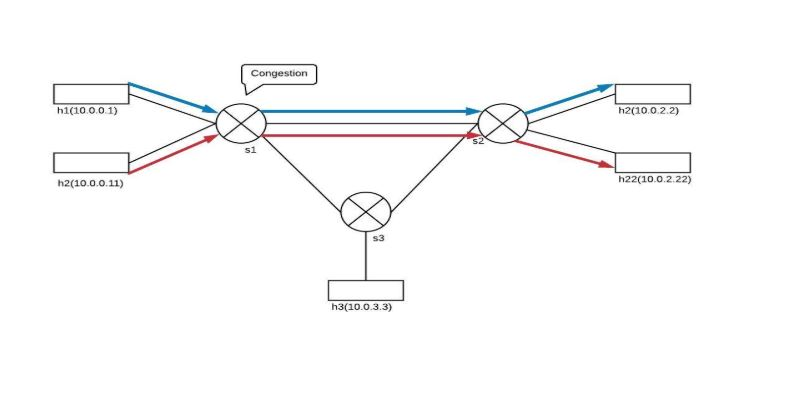

Introduction
============

INSM allows users to track the path and the length of queues that every
packet travels through.  To support this functionality, we have written a P4 program that appends an ID and queue length to the header stack of every packet.  At the destination, the sequence of switch IDs correspond to the path, and each ID is followed by the queue length of the port at switch.

We have defined the control plane rules in src/core/sx-commands.txt and the data plane logic is present in src/core/insm.p4

Environment setup
=================
1. To compile P4 code a lot of dependencies are needed including the p4c compiler. Stanford University has published a VM for instructional use, with all 
the dependencies pre-installed. 
The VM Image can be downloaded from: https://drive.google.com/file/d/1ACkpD66zoBJHCX2K50OO8-pssJGZhzMr/view?usp=sharing

2. Import the image into VirtualBox and start the VM

3. Clone the INSM repository. Execure in shell:
   cd INSM/   

Code Execution
==============

The directory src/core/ contains a P4 program,
insm.p4, which implements L3 forwarding as well as prepends the INSM custom headers.

1. In shell, run:

   cd src/core/  
   sudo make
  
   This will:
   * compile insm.p4, and
   * start a Mininet instance with three switches ('s1', 's2', 's3') configured
     in a triangle. There are 5 hosts. 'h1' and 'h11' are connected to 's1'.
     'h2' and 'h22' are connected to 's2' and 'h3' is connected to 's3'.     
   * The hosts are assigned IPs of '10.0.1.1', '10.0.2.2', etc
     ('10.0.<Switchid>.<hostID>').
   * The control plane programs the P4 tables in each switch based on
     'sx-commands.txt'

2. We want to send a low rate traffic from 'h1' to 'h2' and a high
   rate iperf traffic from 'h11' to 'h22'.  The link between 's1' and
   's2' is common between the flows and is a bottleneck because we
   reduced its bandwidth to 512kbps in topology.json.  Therefore, if we
   capture packets at 'h2', we should see high queue size for that
   link.



3. You should now see a Mininet command prompt. Open four terminals
   for h1, h11, h2, h22, respectively:
   mininet> xterm h1 h11 h2 h22
   
3. In h2's xterm, start the server that captures packets:
   
   ./receive.py
   
4. in h22's xterm, start the iperf UDP server:
   
   iperf -s -u
   

5. In h1's xterm, send one packet per second to h2 using send.py
   say for 30 seconds:
  
   ./send.py 10.0.2.2 "CSC573 is awesome!" 30
   
   The message "CSC573 is awesome" should be received in h2's xterm,
6. In h11's xterm, start iperf client sending for 15 seconds
  iperf -c 10.0.2.22 -t 15 -u
   
7. At h2, the INSM header contains sequence of
 switches through which the packet traveled plus the corresponding
 queue depths.  The expected output will look like the following,
 which shows the INSM header, with a count of 2, and switch ids
 (swids) 2 and 1.  The queue depth at the common link (from s1 to
 s2) is high.
8. type exit to close each xterm window
9. type exit in the mininet console to close stop mininet


A note about the control plane
==============================

P4 programs define a packet-processing pipeline, but the rules
governing packet processing are inserted into the pipeline by the
control plane.  When a rule matches a packet, its action is invoked
with parameters supplied by the control plane as part of the rule.

As part of bringing up the Mininet instance, the
make script will install packet-processing rules in the tables of
each switch. These are defined in the sX-commands.txt files, where
X corresponds to the switch number.

Sample Packet
=============
```
Got a packet
###[ Ethernet ]###
  dst       = 00:04:00:02:00:02
  src       = f2:ed:e6:df:4e:fa
  type      = 0x800
###[ IP ]###
     version   = 4L
     ihl       = 10L
     tos       = 0x0
     len       = 42
     id        = 1
     flags     =
     frag      = 0L
     ttl       = 62
     proto     = udp
     chksum    = 0x60c0
     src       = 10.0.1.1
     dst       = 10.0.2.2
     \options   \
      |###[ INSM ]###
      |  copy_flag = 0L
      |  optclass  = control
      |  option    = 31L
      |  length    = 20
      |  count     = 2
      |  \swtraces  \
      |   |###[ SwitchTrace ]###
      |   |  swid      = 2
      |   |  qdepth    = 0
      |   |###[ SwitchTrace ]###
      |   |  swid      = 1
      |   |  qdepth    = 17
###[ UDP ]###
        sport     = 1234
        dport     = 4321
        len       = 18
        chksum    = 0x1c7b
###[ Raw ]###
           load      = 'CSC573 is awesome!'
```

Cleaning up Mininet
===================
Use the following command to clean up
previous mininet instances:


sudo make clean
